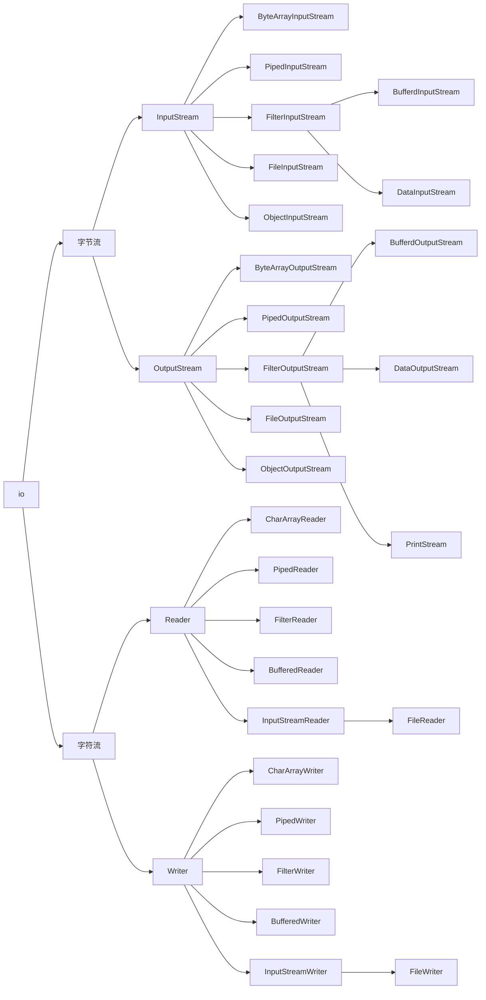

从 JavaIO 学习装饰器模式

Java IO 类库有十几个类，负责 IO 数据的读取和写入。如果对 JavaIO 进行分类，大概可以从两个维度划分为四类。

|        | 字节流       | 字符流 |
| ------ | ------------ | ------ |
| 输入流 | InputStream  | Reader |
| 输出流 | OutputStream | Writer |

