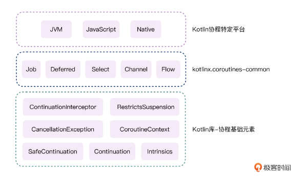

# Flow

1. 冷流（只有消费时，才会生产数据）
1. 最小化协程依赖，结构化并发，上下文保护
1. 数据流串联

```kotlin
// 高阶函数
fun <T> flow(block: suspend FlowCollector<T>.() -> Unit): Flow
<T> = SafeFlow(block)


interface Flow<T> {
    fun collect(collector: FlowCollector)
}

class SafeFlow:  AbstractFlow<T> {

}

class AbstractFlow: Flow<T> {

}
```


## 操作符

filter: 过滤

map: 转换

take: 取值


协程编译环境搭建：
kotlin 代码库：https://github.com/JetBrains/kotlin.git
Coroutines 代码库：https://github.com/Kotlin/kotlinx.coroutines.git
配置 GuideLine：
https://github.com/Kotlin/kotlinx.coroutines/blob/master/CONTRIBUTING.md
https://github.com/JetBrains/kotlin#build-environment-requirements

工作日保持每天学习一个课程

构建知识结构图谱

理解研究目标
关键技术和设计思想

Kotlin 协程特定平台
JVM， JavaScript， Native

kotlinx.xoroutines-common 中间层：
Job， Deferred， Selecte， Channel, Flow


Kotlin 库-协程基本元素
ContinuationIntercepter， RestrictsSuspension， 
CancellationException  CoroutineContext，
SafeContinuation， Continuation，Intrinsics。


挂起函数的原理、协程启动原理、Dispatchers 原理、CoroutineScope 原理、Channel 原理，还有 Flow 的原理





CPS 转换： Kotlin 转换为 Java


吸引用户进来

新型事物会带来很多新的机会，无论是开发者还是企业。以华为在中国市场的影响力，3个方面吧
1. 强化自身
    1. 自身体系的完善和相关第三方产业合作（比如 Unity， 游戏相关）
    2. 加速推进生态建设，保证日常关键应用的持续更新迭代
2. 与开发者共赢
    1. 建立培训体系，吸引更多开发者
    2. 建立相关社区，
    3. 国际化，未来面向海外开发者
    4. 可在校园开启有关课程，从学生开始为自己输入新鲜血液
3. 与企业共赢
    1. 前期利益分成，吸引更多企业入驻，国民级别 app 应率先开始，以保证正常用户的消费习惯
    2. 通过教培体系，面向企业输送开发者

对华为说的话
Harmony OS Next 还很年轻，在这之前，也有很多前辈值得它去学习、去借鉴、去取其精华。
希望 Harmony OS Next 能够优化掉传统开发中的不便捷性，不断完善自己的社区生态，

对开发者说的话
拥抱变化，拥抱未来，拥抱机遇，拥抱自己