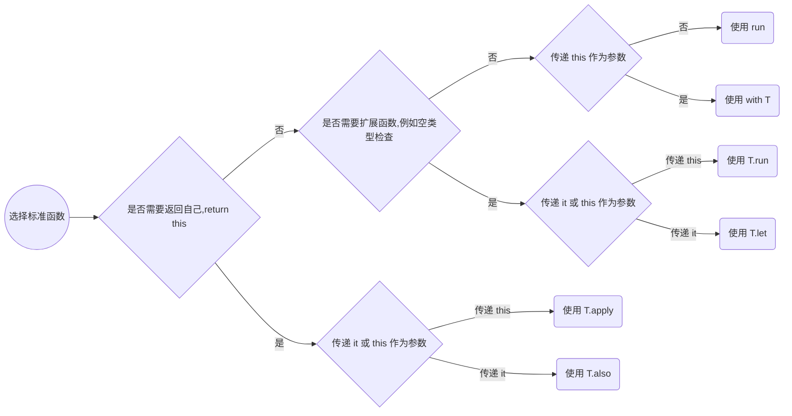

## Kotlin 作用域函数

`run`,` with`, `T.run`,` T.let`,` T.also`, `T.apply` 这些函数，并称为作用域函数，主要功能是为调用者函数提供内部作用域。

### 作用域函数的三个属性特征

1. **普通函数** VS  **扩展函数** 

   如果我们对比 `with` 和 `T.run`  这两个函数，他们实际上是非常相似的。

   ```kotlin
   with (webview.settings) {
     javaScriptEnabled = true
     databaseEnabled = true
   }
   
   webview.settings.run {
     javaScriptEnabled = true
     databaseEnabled = true
   }
   ```

   他们之间唯一的不同在于 `with` 是一个普通函数， 而 `T.run`  是一个扩展函数。

   那么他们的各自优点是什么？

   如果 `webview.settings` 可能为空，那么下面两种方式如何去修改？

   ```kotlin
   // 比较丑的实现方式
   with(webview.settings) {
     this?.javaScriptEnabled = true
     this?.databaseEnabled = true
   }
   
   //比较好看的
   webview.settings?.run {
     javaScriptEnabled = true
   	databaseEnabled = true
   }
   ```

   因此， `T.run`  扩展函数更好，我们可以在使用它之前对空检查

2. `this` vs `it` 参数

   如果对面 `T.run`  和 `T.let` 两个函数也是很相似的，唯一的区别在于他们接受的参数不一样

   ```kotlin
   stringVariable?.run {
     println("The length of this String is $length")
   }
   
   stringVariable?.let {
     println("The length of this String is ${it.length}")
   }
   ```

   查看 `T.run` 的函数声明

   ```kotlin
   @kotlin.internal.InlineOnly public inline fun <T, R> T.run(block: T.() -> R): R { contract { /* compiled contract */ }; /* compiled code */ }
   ```

   我们发现 `T.run` 仅仅是被当做了 `block: T.()` 扩展函数的调用块。因此，它在作用域内， `T` 可以被 `this` 指代。在编码过程中，大多数情况下 `this` 是可以被省略的。所以我们把这个称之为传递 `this 参数`

   对于 `T.let` 函数声明

   ```kotlin
   @kotlin.internal.InlineOnly public inline fun <T, R> T.let(block: (T) -> R): R { contract { /* compiled contract */ }; /* compiled code */ }
   ```

   我们发现 `T.let` 是传递它自己本身到函数中 `block:(T)` ，因此这个类似于传递一个 lambda 表达式作为参数。它可以在函数作用域内部使用 `it` 来指代。所以我们把这个称之为传递 `it 参数`

   从上面看，似乎 `T.run` 比 `T.let` 更有优势，因为它更隐含，但是 `T.let` 函数具有一些微淼的优势，比如：

   1. `T.let` 函数提供了一种更清晰的区分方式去使用给定的变量函数/成员与外部类函数/成员。
   2. 例如当 `it` 作为函数的参数传递时， `this` 不能被省略，并且 `it` 写起来比 `this` 更简洁，更清晰。
   3. `T.let` 允许更好的命名已转换的已使用的变量，即可以将 `it` 转化为其他有含义的名称， 而 `T.run` 则不能，内部只能用 `this` 来指代或者省略。
   
3. 返回 `this` vs 其他类型

   ```kotlin
   stringVariable?.let{
     println("The length of this String is ${it.length}")
   }
   
   stringVariable?.also{
     println("The length of this String is ${it.length}")
   }
   ```

   从上面的代码看，`let` 和 `also` 的内部函数作用域是一样的，他们的微妙区别在于 `let` 返回一个不同类型的值，而 `also` 返回 T 类型本身。

   这两个函数对于函数的链式调用很有用，其中 `T.let` 让你演变操作，而 `T.also` 则让你对相同的变量执行操作。

   ```kotlin
   val original = "abc"
   original.let {
     println("The original String is $it") // "abc"
     it.reversed() // 演变他，并作为参数传递给下一个 let
   }.let {
     println("The reverse String is $it") // cba
     it.length
   }.let {
     println("The length of the String is $it") // 3
   }
   
   original.also{
     println("The original String is $it") // "abc"
     it.reversed() // 即使做了转换，但没有什么用
   }.also {
     println("The reverse String is $it") // abc
     it.length // // 即使做了转换，但没有什么用
   }.also {
     println("The length of the String is ${it}") // "abc"
   }
   
   // 对于 also 的正确使用方式是
   original.also{
     println("The original String is $it") // "abc"
   }.also {
     println("The reverse String is ${it.reversed()}") // cba
   }.also {
     println("The length of the String is ${it.length}") // 3
   }
   ```

   `T.also` 看似没有什么用， 因为我们可以将他们组合到一起操作。那么它的优势呢？

   1. 它可以对相同的对象提供非常清晰的分离过程，即创建更小的函数部分。
   2. 在使用之前，它可以非常强大的进行自我操作，从而实现整个链式代码的构建操作

   **将 let 和 also 组合使用**

   ```kotlin
   // 正常代码
   fun makeDir(path: String): File {
     val resule = File(path)
     result.mkdirs()
     return result
   }
   
   // 组合使用
   fun makeDir(path: String) = path.let { File(path) }.also { it.mkdirs() }
   ```

### 函数选择

