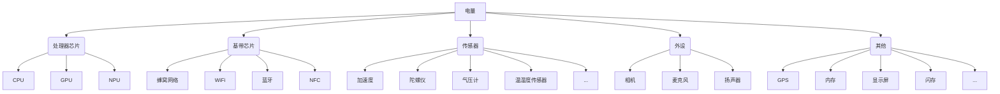

# 电量优化

## 电池技术

衡量电池的关键指标
* 电池容量。 更大的容量意味着更长的续航时间，可通过增加电池的体积或密度来达到这个效果。
* 充电时间。快充技术无非是增大电流或电压，目前主要分为两大解决方案：一个是高压低电流快充方案；另一个是低压大电流快充方案。[快充解决方案](https://mobile.pconline.com.cn/1089/10896724.html)
* 寿命。电池寿命一般使用充电循环次数来衡量，一次充电循环表示充满电池全部电量，但是并不要求一次性完成。
* 安全性。移动设备作为用户随身携带的物品，安全性是首要考虑的因素。无论是容量、电池密度，还是快充技术，首要保证的都是安全性。

## 电量和硬件

应用程序不会直接消耗电池，而是通过使用硬件模块消耗相应的电能。

