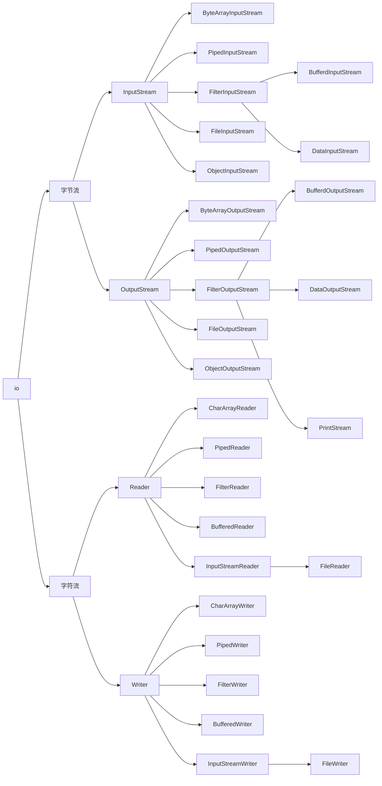

从 JavaIO 学习装饰器模式

Java IO 类库有十几个类，负责 IO 数据的读取和写入。如果对 JavaIO 进行分类，大概可以从两个维度划分为四类。

|        | 字节流       | 字符流 |
| ------ | ------------ | ------ |
| 输入流 | InputStream  | Reader |
| 输出流 | OutputStream | Writer |




刚接触 Java 时，Java IO 有这样一段代码，我们打开文件 text.txt，读取数据。其中 InputStream 是一个抽象类，FileInputStream 是专门用来读取文件流的子类。BufferedInputStream 是一个带有缓存功能的数据读取类，可以奇高读取效率。

```java
InputStream in = new FileInputStream("./text.txt");
InputStream bin = new BufferedInputStream(in);
byte[] data = new byte[128];
while(bin.red(data) != -1) {
  ///...
}
```

这段代码使用起来相当繁琐，
