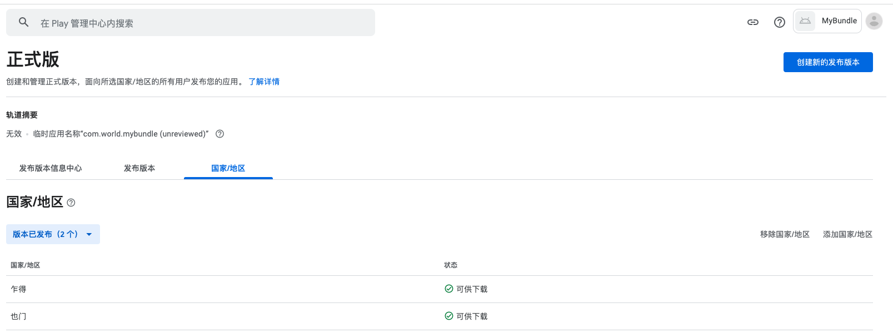

# 海外数据隔离方案调研

## 海外 APP 发布，如何做服务器隔离

对应客户端来说，通过 Google Play 发布应用，同一个包名，只能有一个 APP 存在，不同国家和地区，可根据发布应用时，选择投放国家来处理。
例如，一款非常好用的科学上网软件 `Shadowrocket` 在中国大区，就无法通过 APP store 搜索到。

### 海外数据隔离

因一些国家的隐私政策原因，需要 APP 在投放的国家符合他们的国家政策，详细参阅[Google 开发者政策中心](https://play.google.com/about/developer-content-policy/)
因此，APP 在上传到 Google Play 后，还要有针对性的对一些国家做本地化处理。如数据存储隔离，隐私政策上报等。
同一 APP，需要做不通国家差异化

**网络请求数据隔离**

DNS  解析：

一个域名可以对应多个 IP，通过域名访问接口，是可以通过 DNS 解析，将请求打到固定或指定或最近的服务器上；

在这个基础上，我们假设一个 IP 是一个国家，多个国家使用同一个域名，但服务器 IP 不同，所以在请求域名时，可通过 DNS 解析，将请求打到目标服务器上，也就是不同的国家。

不同的服务器接收到请求后，可将数据存储在本地。以此来达到数据隔离。

### 海外本地化处理

本地化产品可能存在功能差异、交互差异、文化差异，可通过 `Firebase Remote Config` 提供的功能，进行动态配置。
同时也可通过 Google Play 分发功能，依据地区来配置功能模块下发

^[firebase remote config](https://firebase.google.com/docs/remote-config?hl=zh-cn)

^[firebase remote config 用例](https://firebase.google.com/docs/remote-config/use-cases?hl=zh-cn)
