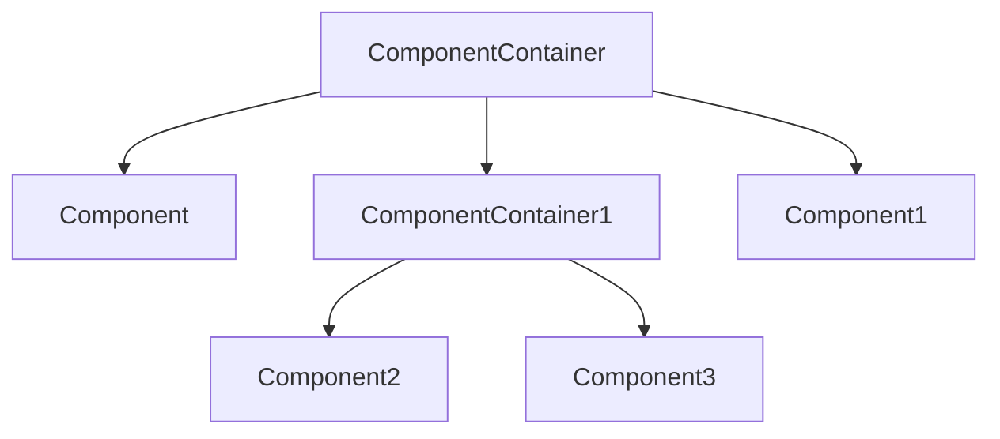

# HarmonyOS Java UI

界面设计和 UI 布局是必不可少的。任何一个应用都需要在屏幕上显示用户界面，包含用户可查看并交互的所有内容。HarmonyOS 的 UI 组件分为两类：单体组件（Component）和可用于装载其他组件的容器组件（ComponentContainer）

UI 组件根据一定的层级结构进行组合形成整齐 UI。单体组件未被添加在容器组件中时，即无法显示也无法交互，一个用户界面至少包含一个容器组件。容器组件中不但可以添加单体组件，也可以添加其他的容器组件，可以形成丰富的 UI 样式。



单体组件和容器组件以树状的层级结构进行组织，这样的布局被称为视图树。视图树的特殊是仅有一个根视图，其他视图有且仅有一个父节点，视图之间的关系收到父节点的规则约束。

## UI 单体组件

HarmonyOS 常用的单体 UI 组件全部集成自 Component 类，Component 类包含了对 UI 组件的全部常用方法。如创建、更新、缩放、旋转及设置各类事件监听器。其他的 UI 组件，如 Text， Button 等，都是在 Component 类的基础上添加了对应的功能实现的。

### Text 组件

Text 用来显示字符串的组件

#### 1. Java 代码创建 Text 组件

我们在 `entry->src->main->package->Slice` 中的 MainAbilitySlice.java 文件


在 onStart 方法中修改

```java
@Override
public void onStart(Intent intent) {
  super.onStart(intent);
  // 容器
  DirectionalLayout myLayout = new DirectionalLayout(this);
  myLayout.setWidth(DirectionalLayout.LayoutConfig.MATCH_PARENT);
  myLayout.setHeight(DirectionalLayout.LayoutConfig.MATCH_PARENT);
  myLayout.setAlignment(LayoutAlignment.HORIZONTAL_CENTER);
  myLayout.setPadding(32, 32, 32, 32);

  // Text 组件
  Text text = new Text(this);
  text.setWidth(DirectionalLayout.LayoutConfig.MATCH_CONTENT);
  text.setHeight(DirectionalLayout.LayoutConfig.MATCH_CONTENT);
  text.setText("This is Text Component");
  text.setTextSize(24, Text.TextSizeType.VP);
  myLayout.addComponent(text);

  super.setUIContent(myLayout);
}
```


`super.setUIContent(myLayout)` 将创建好的 Text 组件实例 text 放入容器组件中。也可通过 Java 代码增加一些修饰:

```java
// Text 组件
Text text = new Text(this);
text.setWidth(DirectionalLayout.LayoutConfig.MATCH_CONTENT);
text.setHeight(DirectionalLayout.LayoutConfig.MATCH_CONTENT);
text.setText("This is Text Component");
text.setTextSize(24, Text.TextSizeType.VP);
text.setTextColor(Color.GREEN);
text.setFont(Font.SANS_SERIF);
```


#### 2. xml 创建 Text 组件

`entry->src->main->resource->base->layout->layout_main.xml`


```java
@Override
public void onStart(Intent intent) {
  super.onStart(intent);
  super.setUIContent(ResourceTable.Layout_ability_main);
}
```

